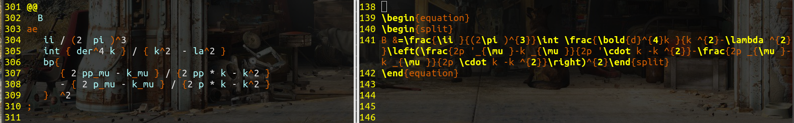
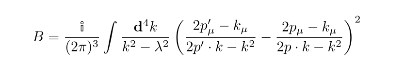

# TexStackExpander
A tool to type out latex formula fast, consize and clear.
it is powered by flex and bison and designed for physics
students like myself to type formul in latex as fast as crazy.
It help to skip typing lots of bloat that you do not need in latex.
and only focus on the formula

# demonstration
on the left side in this picture
is a fraction of Tex Stack Expander typed consise formula.
And on the right side shows the expanded into latex reqcognizeable formula

and the typing above finally become this fomula


it is a great tool to type out massive amount of formula's
and you don't even need scratch paper any more. You just have to type in Latex.
To smoothly use this software, using vim editor is recomended. As well as
using entr to montor the file change and make the pdf automatically.
for example : 
```
echo "test.osc" | entr pdflatex test
```
in this code, the Tex Stack Expander words are writen in the "test.osc". and 
runing this commad makes the entr to watch that file. if that file is changed.
it will run the pdftlatex command to compile it into pdf.

# build and usage
```
git clone "https://github.com/OrkeshNurbolat/TexStackExpander/"
cd TexStackExpander
make
```
then there will be a executable created at TexStackExpander/bin/TexStackExpander.

if it can not execute, please give it the permission
```
chmod 775 TexStackExpander/bin/TexStackExpander
```
to take in a TexStackExpander file and output a Tex file, all need to do is to type out
```
TexStackExpander/bin/TexStackExpander infile.osc output.tex
```
in that "infile.osc" some consize text is typed and it is translated to a latex file 
and output into the "output.tex". now the "output.tex" could be compiled
with any tex compiler for example pdf latex. 
or it could be included into a template tex file and then that file to be compiled.
for example 
```
pdflatex ouput.tex
```


# the simple grammar
## defining variables
To define a symbol, for example "hA" to be "\hat{A}" in latex : 
```
A "A" ; 
hat "\hat{" #1 "}" ; 
hA hat A ;
```
here on the first line , the symbol A is defined to be the string "A" ,
and on the second line, the symbol hat is defined to be a function where
it requires an argument.
on the third line now hA is defined to be latex "\hat{A}" , since function hat is called with
an argument A.

so one can keep going
```
om "\omega";
H "H" ; 
hH "\hat{H}" ;
hb "\hbar" ; 
ae "&=";
a "a"; 
dag "\dagger{" #1 "}" ; 
ao hat a;
ad dag ao ;
+ "+" ; 
```
say if you have all your most common used symbols defined in a file "basic.osc".
then on another file you can import all the symbols by a line 
```
#include<~/abc/basic.osc>
```


## writing equations

### embeded equations
To write equations, one should be aware of symbols defined ahead.
to write the equation that is embeded in the latex text, it should be written in 
```
$ <type your equation here> ; 
```
for example in a TexStackExpand file I wrote
```
$ [ hA , hB ] = hA hB - hB hA ; 
```
then it can be translated into latex as : 
```
$ [ \hat{A},\hat{B}] = \hat{A}\hat{B} - \hat{B}\hat{A}$
```

### individual equations
To write labled equations that usually take up the whole line and end up with a number
label in the end that indicates which formula it is, a syntax like this can be  used
```
@@
  <type your equation here>
;

```
for example 
```
@@ lab "eq1"
  hH
 ae
  hb om bp {
    ad ao +  1 / 2 
  }
;
```
can be expand into latex formula as
```
$$
\label{eq1}
\hat{H}
&=
\hbar \omega \left(
\dagger{\hat{a}} \hat{a}
+ \dfrac{1}{2}
\right)
$$
```
### writing or overriding with plain latex
if you have something that have to be writen in latex
ten you could just type this way
```
! <This string will be directly put into the latex>
```

for example
```
! by the \eqref{Ham} we know this is true
```
is just going to become a line in the output latex as

```
by the \eqref{Ham} we know this is true
```

### commenting
to comment out things that you do not want to translate, just write
```
% <This is commented out not going to be translated>
```
but if you have writen this 
```
% ! test
```
this line would not be translated.
However if you writed this : 
```
! % test
```
this line will be translated into the target output latex file as a line of comment as
```
% test
```
